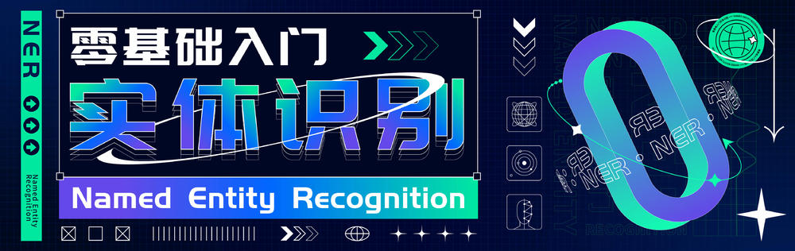

## 命名实体识别

### 1 CH&和鲸训练营：零基础入门实体识别

> 免费活动链接:https://www.heywhale.com/home/activity/detail/6216f74572960d0017d5e691

课程内容：
```text
1、实体识别任务简介
命名实体识别任务定义、概念、标注和数据集介绍

2、实体识别任务实践(一)-CRF
利用CRF模型实现中文实体识别

3、实体识别任务实践(二)-传统深度学习
基于BiLSTM-CRF实现中文实体识别

4、实体识别任务实践(三)-Bert
基于Bert预训练模型实现实体识别

5、实体识别任务总结
命名实体识别提升思路与优化方法总结

直播回放可在我的课程中查看
```
课程资料：https://github.com/yanqiangmiffy/Product-Entity-Recognition/tree/master/ner-camp

### 2 GAIIC2022：商品标题实体识别
> 比赛链接:https://www.heywhale.com/home/competition/620b34ed28270b0017b823ad/
#### 赛题任务
>京东商品标题包含了商品的大量关键信息，商品标题实体识别是NLP应用中的一项核心基础任务，能为多种下游场景所复用，从标题文本中准确抽取出商品相关实体能够提升检索、推荐等业务场景下的用户体验和平台效率。本赛题要求选手使用模型抽取出商品标题文本中的实体。
与传统的实体抽取不同，京东商品标题文本的实体密度高、实体粒度细，赛题具有特色性。

#### 模型思路
| 模型  | 线下cv | 线上    |
|-----|------|-------|
| CRF | 0.77 | 0.748 |

代码链接：https://github.com/yanqiangmiffy/Product-Entity-Recognition/tree/master/competition_code
### 3 其他大佬方案
- [DataArk-GAIIC2022-Product-Title-Entity-Recognition-Baseline 线上0.801](https://github.com/DataArk/GAIIC2022-Product-Title-Entity-Recognition-Baseline)
- [xmxoxo 思路分享](https://www.heywhale.com/org/gaiic2022/competition/forum/623926c7b6b6610017eb012e)
```text
以下是本人的一点尝试思路分享给大家，仅供参考。

不同模型的对比：
BERT+CRF
参考地址：https://github.com/bojone/bert4keras/tree/master/examples/task_sequence_labeling_ner_crf.py

BERT+BiLSTM+CRF

BERT+双指针

BERT+GlobalPointer
参考地址：https://github.com/bojone/GlobalPointer

找到最优的模型，在此基础上再做提升：
换 roberta_wwm；roberta_wwm_large
加对抗训练
参考地址：https://github.com/bojone/bert4keras/tree/master/examples/task_iflytek_adversarial_training.py

加数据增强EDA
参考地址： https://blog.csdn.net/hero00e/article/details/89523970

预训练模型

参考地址：https://github.com/bojone/bert4keras/tree/master/pretraining
```
- [bert研究院:命名实体识别技术bert,bert+crf等优化方案](https://aistudio.baidu.com/aistudio/projectdetail/3556204?contributionType=1)
- [虎牙181469:LEBERT-pytorch，根据作者源码改装成本大赛格式](https://www.heywhale.com/org/gaiic2022/competition/forum/6224963cfd71770017f319b9)
```text
个人实验了半天，发现成绩没有比BERT+CRF好，可能是数据比较少的原因，
有兴趣的朋友可以进来看看，Star一下。

目前成绩 ：
BERT+CRF：73.91
BERT_SPAN：74.31
LEBERT+CRF: 73.13

用到的词向量与论文中提到的相同，可以去https://ai.tencent.com/ailab/nlp/en/download.html 这里下载，我下载的small版本，如果论文里的score为真实的，我发布的代码一定可以拿到很高分。

论文地址：https://arxiv.org/pdf/2105.07148v3.pdf
github链接为：https://github.com/fuxuelinwudi/LEBERT_pytorch_copied_from_author
后续我还会发布BERT+MRC、FLAT等等之前的SOTA模型。

tips：

1.BERT+CRF版本的github链接为：https://github.com/fuxuelinwudi/BERT_CRF_NER_torch
2.BERT+SPAN版本的github链接为：https://github.com/fuxuelinwudi/BERT_SPAN_NER_torch
3.可偏旁特征与拼音特征：用pypinyin包，和https://github.com/WenDesi/Chinese_radical 来做
```

### 4 关于ChallengeHub

由算法与数据分析小伙伴们一起创建，获得数十次比赛top奖项，成员来自国内大厂、中科院研究所等，可帮忙内推～。每日给小伙伴带来机器学习、NLP、数据分析知识分享以及竞赛干货，职场经验。
欢迎大家关注，也欢迎大家进入我们的NLP技术交流群，可以添加我的个人微信联系方式

[//]: # (<center>)

[//]: # ()
[//]: # (<div align=center></div>)

[//]: # (<div align=center></div>)

[//]: # (<div align=center></div>)

[//]: # (</center>)

<center class="half">


 
</center>
